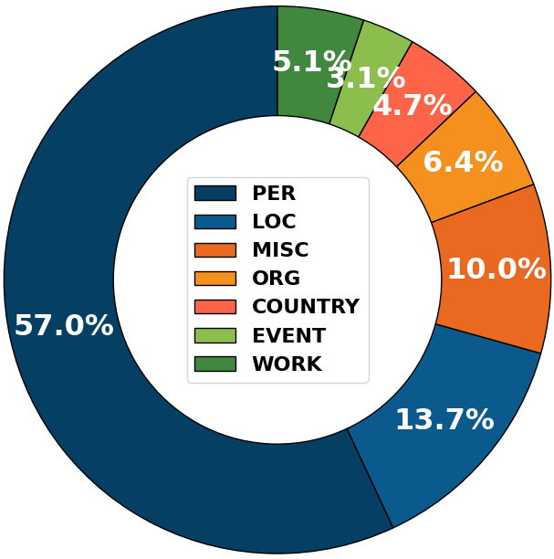

<div align="center">

<h1>VP-MEL: Visual Prompts Guided Multimodal Entity Linking</h1>
</div>

<br>

<div align="center">

</div>

# VP-MEL

# Todo List⏳

 - [ ] Release datasets and training and inference scripts.
 - [ ] Release complete code for the FBMEL model.
 - [ ] Release new VPWiki dataset.

# VPWiki Dataset
</div>

<br>

<div align="center">

</div>

Our VPWiki dataset is built on two benchmark MEL datasets [WikiDiverse](https://aclanthology.org/2022.acl-long.328) and [WikiMEL](https://doi.org/10.1145/3477495.3531867):

The above figure shows an example from VPWiki and WikiDiverse. The red box in the left image represents the visual prompt annotated for the VP-MEL task. The red text in the right image shows the annotated mention words.

</div>

<br>

<div align="center">

</div>

We provide some sample data [here](dataset/VPWiki/test.json), and some of the corresponding images can be found in the [folder](dataset/VPWiki/test_img(Example)/).  The complete dataset will be released in subsequent updates.

# Usage
The complete code will be updated in the **FBMEL/** folder. This part will be completed after the code update.
### Step 1: Set up the environment

### Step 2: Download the data

### Step 3: Instruction fine-tune the VLM

### Step 4: Start the training

# Citation
If you find this work useful in your research, please consider citing:

```
@article{mi2024vpmelvisualpromptsguided,
  title={VP-MEL: Visual Prompts Guided Multimodal Entity Linking},
  author={Hongze Mi and Jinyuan Li and Xuying Zhang and Haoran Cheng and Jiahao Wang and Di Sun and Gang Pan},
  journal={arXiv preprint arXiv:2412.06720},
  year={2024}
}

